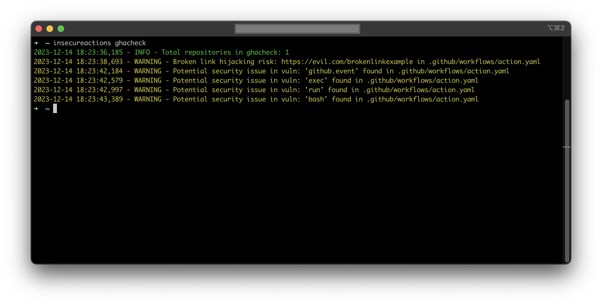

<p align="center">
<a href="https://deeplooklabs.com"></a>
</p>

### Description
`insecureactions` is a Python script designed to identify potential security vulnerabilities in GitHub Actions workflows. It scans repositories in a GitHub organization for dangerous patterns such as command injections, unsafe usage of secrets, and checks for broken links that could lead to hijacking attacks.

### Prerequisites
- Python 3.x
- GitHub Access Token with appropriate permissions to read repositories in the organization

### Installation
Clone the repository:
```bash
git clone https://github.com/deeplooklabs/insecureactions.git
```

Navigate to the cloned directory:
```bash
cd insecureactions
```

Install the script using pip:
```bash
pip install .
```

### Usage
To run the script, execute the following command in the terminal, replacing ORGNAME with the name of the GitHub organization you wish to scan:

```bash
insecureactions ORGNAME
```

The script will iterate through all repositories in the provided organization, checking each workflow file for dangerous patterns and broken links.

### Test

To test check:
```bash
insecureactions ghacheck
```

<p align="center">
<a href="#"></a>
</p>


### Logs
The script provides colored logs to make it easier to distinguish between informational messages, warnings, and errors.
You can customize the logging level and format as per your requirements.

### Disclaimer
This script is provided for educational and testing purposes only. Do not use it in production environments without proper analysis.
Use of this script is at your own risk. The author is not responsible for any consequences arising from its use.

### Contributions
Contributions to improve insecureactions are welcome. Feel free to fork the repository, make your changes, and open a pull request.

