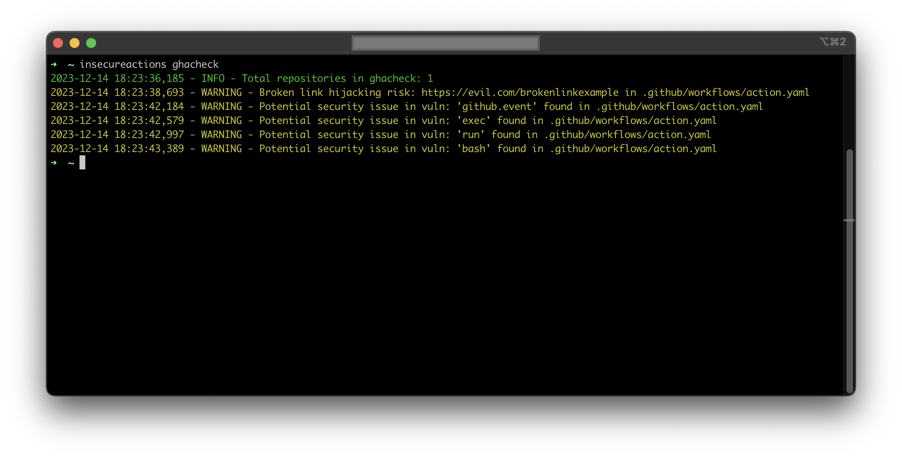

<p align="center">
<a href="https://deeplooklabs.com"></a>
</p>

### Description
`insecureactions` scans every public repository in a GitHub organization (or user account) for common security issues in GitHub Actions workflows:

- **Script injection in `run:`** — untrusted `${{ github.event.* }}` expressions (PR titles/bodies, issue bodies, comments, commit messages, head_ref, …) interpolated directly into a shell command.
- **Script injection in `actions/github-script`** — same class of untrusted-input flow, but the sink is the `script:` parameter of `actions/github-script` instead of `run:`.
- **`pull_request_target` + checkout of PR ref** — runs attacker-controlled code with a write-scoped `GITHUB_TOKEN`. Catches both `ref:` and `repository:` shapes.
- **Build/install on untrusted checkout** — `pip install`, `python setup.py`, `npm ci`, `./gradlew`, `make`, `go build`, etc. running after a privileged checkout of attacker-controlled code (the MITRE/Splunk/spotipy class — see [Sysdig](https://www.sysdig.com/blog/insecure-github-actions-found-in-mitre-splunk-and-other-open-source-repositories)).
- **Self-hosted runner exposed to fork-driven triggers** — `runs-on: self-hosted` combined with `pull_request`, `pull_request_target`, `workflow_run`, `issue_comment`, or `fork`.
- **`GITHUB_TOKEN` permissions** — flags workflows with no `permissions:` block (inherits the often-too-broad repo default) or `permissions: write-all`.
- **Pipe-to-shell from URL** — `curl … | bash`, `wget … | sh` inside `run:` blocks.
- **Outdated first-party actions** — `actions/checkout@v1` (token leak), `@v2`/`@v3` (deprecated Node 12/16 runtimes).
- **Known-compromised actions** — blocklist for `tj-actions/changed-files`, `reviewdog/*` (CVE-2025-30066, Mar 2025) and similar supply-chain incidents.
- **`secrets: inherit`** on reusable workflow calls — passes every caller secret to the called workflow.
- **Unpinned third-party actions** — `uses:` references to non-first-party actions pinned to a tag or branch instead of a full commit SHA.
- **Broken-link hijack risk** — optional probe of URLs found in workflow files.

### Prerequisites
- Python 3.7+
- GitHub access token (classic or fine-grained) with at least `public_repo` / `metadata:read` on the target org.

Export the token before running:
```bash
export GITHUB_ACCESS_TOKEN=ghp_xxx   # GITHUB_TOKEN is also accepted
```

### Installation
```bash
git clone https://github.com/deeplooklabs/insecureactions.git
cd insecureactions
pip install .
```

> pipx:
```
pipx install git+https://github.com/deeplooklabs/insecureactions.git
```

### Usage
```bash
insecureactions TARGET [TARGET ...]
```

Each `TARGET` can be:
- `org-or-user` — scan every repository owned by that organization or user account
- `owner/repo` — scan a single repository

Flags:
```
--check-links     Also probe URLs for hijack risk (slow)
-w, --workers N   Concurrent repository scanners (default: 8)
```

Examples:
```bash
# Whole organization
insecureactions deeplooklabs

# Multiple orgs / users in one run
insecureactions myorg otheruser --check-links

# A single repository
insecureactions owner/specific-repo

# Mixed targets
insecureactions myorg owner/critical-repo -w 16
```

### Output
Findings are logged with a `[finding-type]` tag and the location `org/repo:path/to/workflow.yml`:

```
[script-injection]                org/repo:.github/workflows/ci.yml -> ${{ github.event.issue.title }}
[pull_request_target+checkout-pr-ref] org/repo:.github/workflows/pr.yml -> attacker-controlled code may run with write token
[unpinned-action]                 org/repo:.github/workflows/ci.yml -> some/action@v3
[broken-link]                     org/repo:.github/workflows/ci.yml -> https://example.com/foo (404)
```

<p align="center">
<a href="#"></a>
</p>

### Disclaimer
Provided for educational and authorized security-testing purposes only. Use against organizations you are permitted to assess.

### Contributions
PRs welcome — fork, branch, open a pull request.
